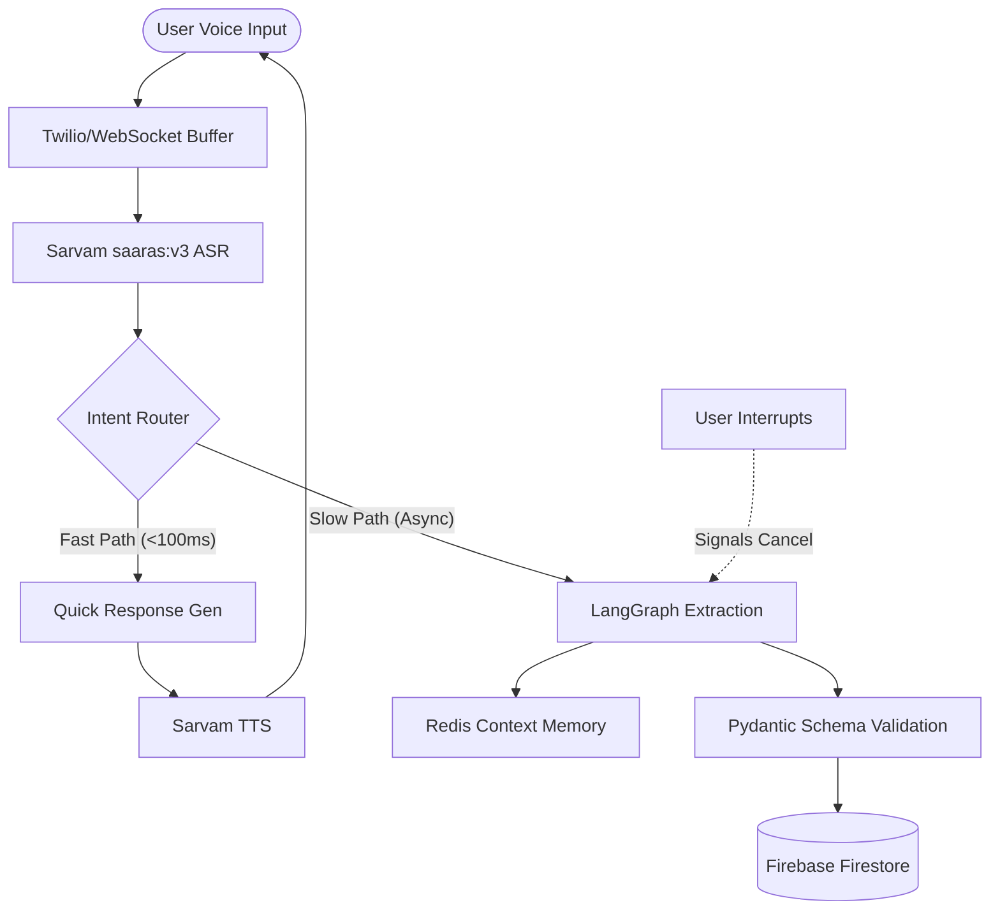

# VaakSetu

VaakSetu is a real-time, interruptible voice intelligence platform built to bridge the multilingual gap in India. It converts code-mixed, multi-dialect conversations into structured, actionable data for critical domains like Healthcare and Finance.

This project was developed for the Samsung PRISM GenAI Hackathon 2026 under Theme 5: Interruptible Real-Time Agents.

## Architecture Overview

The system employs a dual-path architecture to ensure latency remains sub-100ms for user feedback (Fast Path), while a LangGraph-driven state machine performs rigorous, schema-locked extraction (Slow Path). If the user interrupts or corrects themselves, the system instantly cancels the in-flight Slow Path and re-evaluates the context.

## Core Capabilities

1. Multi-Dialect Core: Natively processes code-mixed speech (e.g., Hinglish, Kanglish) without prior language selection.
2. Interruptible Graph Execution: Built on LangGraph, the agent accurately handles self-corrections mid-sentence by terminating stale asynchronous tasks.
3. Schema-Locked Extraction: Forces the LLM to output Pydantic-validated JSON, guaranteeing zero hallucination of field names for downstream APIs.
4. Domain Agnostic: Configurations for distinct verticals (Healthcare, Finance, Support) are injected dynamically. 
5. Visual Grounding: Capability to ingest video frames via WebSockets, allowing the LLM to augment the dialogue context with live visual analysis.

## Repository Structure

* `/backend` - FastAPI server handling the LangGraph orchestration, Twilio WebSocket streams, and Firestore database integration.
* `/frontend` - Next.js 14 dashboard providing real-time visualization of the conversational state and extracted payloads.

## Local Setup Instructions

### Prerequisites
* Python 3.14+
* Node.js 20+
* Firebase Service Account credentials

### Backend Configuration
1. Navigate to the backend directory.
2. Copy `.env.example` to `.env` and populate it with your API keys (Sarvam AI, Gemini, HuggingFace).
3. Place your Firebase credentials file at `backend/firebase_credentials.json`.
4. Create and activate a virtual environment.
5. Install dependencies: `pip install -r requirements.txt`
6. Start the server: `python -m uvicorn task2_backend.main:app --host 0.0.0.0 --port 8000`

### Frontend Configuration
1. Navigate to the frontend directory.
2. Install dependencies: `npm install`
3. Start the development server: `npm run dev`
4. Access the dashboard at `http://localhost:3000`.

## License

This project is licensed under the MIT License. See the LICENSE file for details.
