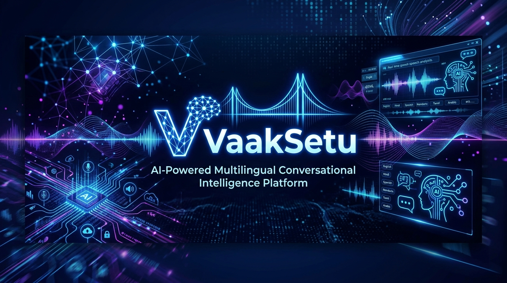
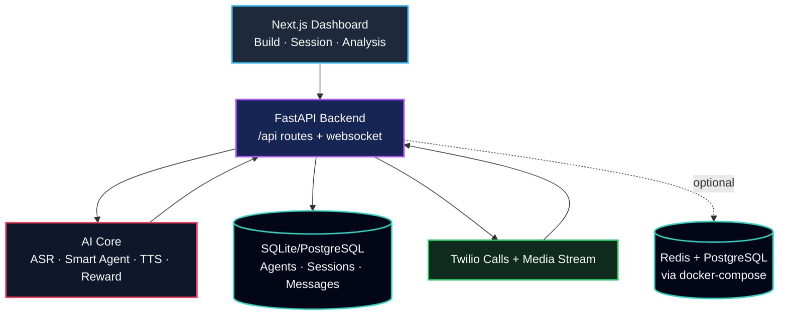

<div align="center">



<br/>

# 🔊 VaakSetu
### AI-Powered Multilingual Conversational Intelligence Platform

*वाक् + सेतु — The Voice Bridge for Bharat*

<br/>

[](https://python.org)
[](https://fastapi.tiangolo.com)
[](https://nextjs.org)
[](https://react.dev)
[](https://docker.com)

<br/>

> **VaakSetu** is an autonomous voice AI stack that can observe or run multilingual call flows, understand Indian code-mixed speech in real time, and generate structured records with human-readable summaries for healthcare and financial operations.

</div>

---

## 🚀 The Problem

India runs on voice. But documentation still runs on manual entry. 

**VaakSetu reduces manual burden with real-time extraction + structured storage.**

| 📉 Pain Point | 🚨 Operational Impact |
|---|---|
| ASHA / field workflows require manual call notes | High overhead, delayed reporting |
| Clinical and support teams spend time on post-call paperwork | Reduced service throughput |
| Code-mixed inputs (Hinglish/Kanglish) break rigid bots | Lost context and poor extraction |
| Loan collection / follow-up calls lack structured records | Compliance and audit friction |

---

## ✨ What VaakSetu Does

VaakSetu acts as a conversational intelligence layer for live calls and session workflows. 

- 🎙️ **Listens / transcribes** multilingual and code-mixed speech with advanced ASR.
- 👥 **Tracks roles and context** across turns for agent-quality interactions.
- 🧠 **Runs configurable dialogue agents** using dynamic agent templates.
- 📋 **Auto-collects structured fields** per domain (healthcare / financial).
- ✍️ **Generates readable summaries** and logs conversation history.
- 📞 **Supports Twilio call paths** for outbound and media-stream integration.
- 🔄 **Switches domain behavior by config** dynamically.
- 🤖 **Scores completed sessions** with programmatic + LLM-judge reward signals.

---

## 🏗️ System Architecture



---

## 🛠️ Tech Stack

<details>
<summary><b>Click to expand Tech Stack details</b></summary>
<br>

**AI / ML**
- `Sarvam STT (saaras:v3)` — Primary ASR
- `AI4Bharat IndicWhisper` — Fallback ASR
- `Sarvam-M` — Conversational LLM via LangChain
- `pyannote.audio` — Diarization support
- `LangGraph` — Stateful conversational graph
- `LLM Judge` — Reward scoring

**Application / Infra**
- `FastAPI` + `uvicorn` — Backend APIs
- `Next.js 15` + `React 19` — Frontend
- `SQLite` / `PostgreSQL` — Persistence
- `Redis` — Caching layer
- `Twilio SDK` — Outbound/media flow
- `Docker Compose` — Container orchestration

</details>

---

## 🏥 Supported Domains

### Healthcare
- Patient identity + demographics
- Symptoms and duration
- History / medications / allergies
- Clinical and risk indicators
- Escalation triggers for emergency language

### Financial Services
- Customer and loan identifiers
- Payment status and details
- Delay reasons and follow-up notes
- Escalation triggers for legal/fraud phrases

---

## ⚡ Quick Start

### 1. Clone & Configure
```bash
git clone https://github.com/Shudhanshu9122/VaakSetu.git
cd VaakSetu
```

### 2. Infrastructure (Optional)
```bash
docker-compose up -d
```

### 3. Backend Setup
```bash
cd backend
python -m venv venv
venv\Scripts\activate  # Windows
# source venv/bin/activate # Linux/macOS

pip install -r requirements.txt
python -m uvicorn main:app --host 0.0.0.0 --port 8000 --reload
```

### 4. Frontend Setup
```bash
cd frontend
npm install
npm run dev -- --port 3000
```

---

<div align="center">
<br/>

**VaakSetu** — *Bridging Languages, Automating Workflows*

<br/>
</div>
